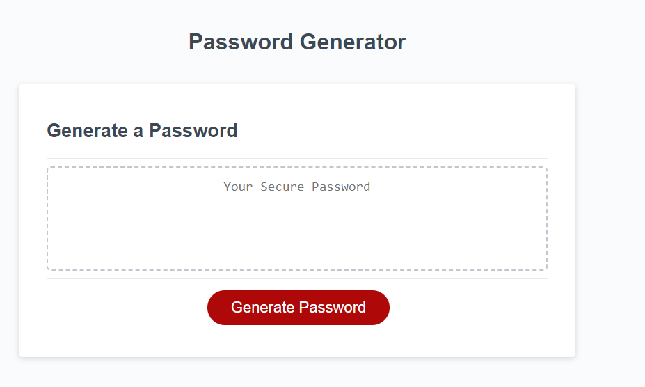

# Password-Generator

## Description 
In this project I had to test my knowledge thus far and see if I could create a password generator with the pre existing information provided. This application was mainly focused around JSS; thus mainly I learned ALOT on this coding language. THe main two main points I learned are as follows: 
 

**Spelling/Order matters** When starting off I was not super aware of how important spelling is in JS. I would add one line such as the promts. I would use different spelling and would wonder why it didnt work when trying to run the application. Thus I realized how important capitalizing the second part of the Var name to make sure it can be identified properly later on. Additionally this doesnt just matter on words but also on ";", "if statement" order, "()". All these thigns matter as they located in the "FUNCTION: Generate passowrd" my website would not run unless everything was properly spelt/closed on the js file. The order of items also matters I had originally listed my Vars above the function and for some reason the code was not reading the inputs and selections. Until I placed those inside the function we are solving for then it worked! So importance on where the items are!
 

**Debugging!!** Along this project one of the best tools I learned to use was the consol.log tool to help me identify where my problem is in the file so I can go back and reverse engineer it. Learning to do this much sooner would have saved LOTS of time as the console log even lets you know what line there might be a mistake. 

## Installation
In order to install this project you will have to clone the repository: 
    1. Create a place where you will want to store all this information 
    2. Once there open GitBash
    3. Clone this repository into the file you will have this stored in
            enter following: git@github.com:juanthtgotaway/Password-Generator-.git
    4. Press enter to create your local clone

## Usage
This code can be used to generate unique passwords.

## Credits
https://www.w3schools.com/jsref/met_win_prompt.asp
https://www.w3schools.com/jsref/event_onclick.asp
https://www.youtube.com/watch?v=w2pKs7qqf4c
https://stackoverflow.com/questions/34929094/how-can-i-get-all-possible-characters-in-javascript
https://timonweb.com/javascript/how-to-get-a-random-value-from-a-javascript-array/
https://www.thoughtco.com/concatenation-2034055 
https://stackoverflow.com/questions/43267033/understanding-the-use-of-math-floor-when-randomly-accessing-an-array
https://www.youtube.com/watch?v=4IF592zYmB0
     
## License 
N/A
